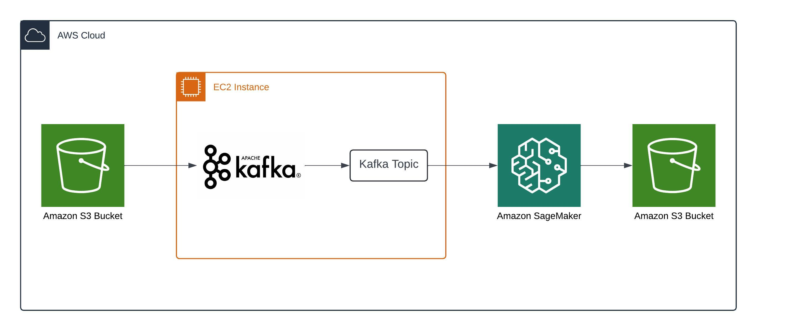

# Real-Time-Accident-Severity-Prediction
## Introduction
This project involves designing a real-time machine learning , Deep learning system that predicts the severity of road accidents using historical and live data. The system is primarily aimed at enabling emergency responders to allocate resources effectively based on the predicted severity, ultimately aiming to reduce mortality rates in severe accidents.

## Architecture

## Technology Used
1. Programming Language - Python
2. Amazon Web Services
   - EC2 Instance
   - S3 Bucket
   - Sagemaker
3. Apache Kafka (distributed streaming tool)

## Workflow and Implementation Details

### Model Development
The project began with the development of a machine learning model using Python. Started by conducting extensive data cleaning, Exploratory Data Analysis (EDA), and feature selection to ensure that only the most relevant features were used.
Feature engineering was done to create new features that could improve model performance.
After preparation of the data, experimentation with various classification algorithms, including Decision Trees and Random Forests was done, to build models that predict the injury severity based on accident data.
The final model was selected based on its performance metrics, and was saved as a pickle file for deployment.

### Uploading the Model to S3

Once the model was finalized, the pickle file was uploaded to an S3 bucket. This allowed to easily access and deploy the model within different components of the system.

### Setting Up Kafka on EC2

Next, a Kafka ecosystem was setup on an EC2 instance. Started by running Zookeeper, which manages the Kafka brokers, and then launched Kafka itself.
Kafka topics were created, which would be used to store and manage the streaming data. The real-time accident data was stored in S3 and then pushed into these Kafka topics.

### Real-Time Data Processing with Kafka Consumer

To process the real-time data, a Python Jupyter notebook was developed on Amazon Sagemaker where Kafka consumer code was written.
This consumer code is responsible for continuously collecting batches of data from the Kafka topic. The data is initially received in string format.

### Data Conversion and Prediction

Upon receiving the data from Kafka, the code first converts the string data into the appropriate numerical format required by the machine learning model.
It then fetches the trained model from the S3 bucket and uses it to predict the injury severity based on the incoming data.
The prediction results are stored back in the S3 bucket, ensuring that all output data is persistently available for further analysis or use.

### Model Retraining and Continuous Processing

The code is designed to run continuously, fetching data from the Kafka topic, making predictions, and storing the results in S3.
Additionally, the model can be periodically retrained, and the new model version can replace the old one in S3, allowing the system to adapt to new data patterns over time.
This process continues as long as new data is fed into the Kafka topic, ensuring real-time predictions are made and stored.

### End-to-End Pipeline

The entire system forms a robust ETL (Extract, Transform, Load) pipeline. Data is extracted from the Kafka topic, transformed into a format suitable for the ML model, predictions are made, and the results are loaded back into the S3 bucket.
The pipeline ensures that the system is scalable and can handle large volumes of streaming data, making it highly suitable for real-time use cases like accident severity prediction.
